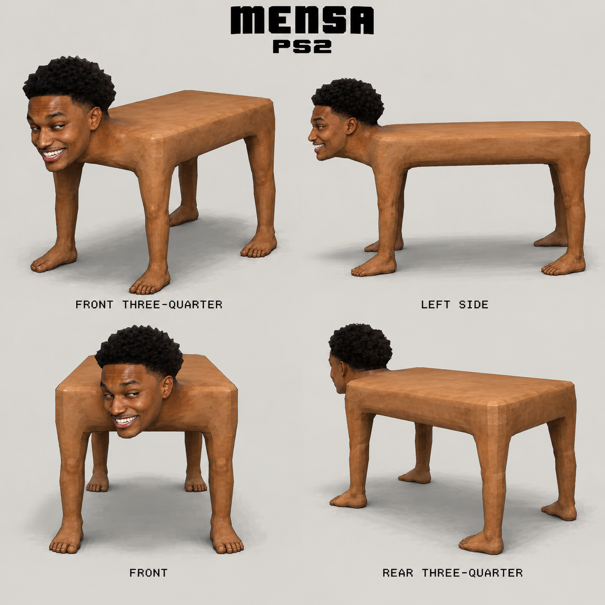
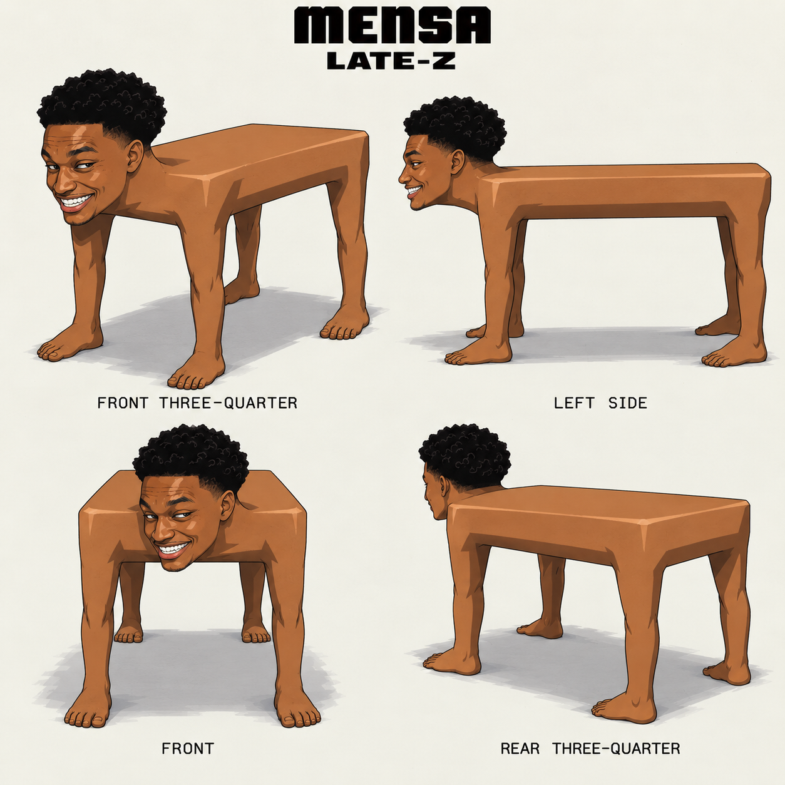

# Mensa Community Engine

**Make Mensa images, memes, and short scenes from an ordinary idea.**

Tell the Engine what the human table should do. It keeps Mensa recognizable and helps you create pictures, plan shots, write video prompts, and fix details along the way. You do not need prompting knowledge.

Choose **Flagship PS2** for raw early-2000s game graphics, or **Late-Z Battle Cel** for mid-1990s battle-anime scenes. Both character turnaround sheets are included.

## What you need

- **ChatGPT with Skills and image generation** to create pictures in the chat.
- **A separate video tool** to animate them, or a connected video provider your assistant can use. The Engine prepares the frames and prompts; third-party generation and credits are separate.

## Install in ChatGPT

1. Download [mensa-community-engine.zip](https://github.com/nosimajtechnology/mensa-community-engine/releases/latest/download/mensa-community-engine.zip). **Do not unzip it.**
2. In ChatGPT, open **Plugins**, then **Skills**, and choose **Create / Upload**. Select the ZIP. If your app does not show uploading, use ChatGPT in a browser.
3. Open a chat and ask it to load **Mensa Community Engine**.

Once installed, use it wherever your account supports personal Skills, including supported mobile workspaces. Refresh the Skills page if a newly installed skill is not visible yet.

Start with:

```text
Load the Mensa Community Engine. Make a PS2 scene where Mensa carries one cup of tea through a thunderstorm. No music.
```

The Engine will help you build it one step at a time. Reply **Approved** when a frame is right. If one detail is wrong, just say what to change.

## What you can make

| Choose | Make |
| --- | --- |
| Character | A character study, pose, or turnaround |
| Still | One finished image, wallpaper, or fake screenshot |
| Meme | A quick relatable or absurd scene |
| Scene | One short connected event |
| Classic Cinematic | A first frame, storyboard, and animation prompt |
| Tape / Bumper | A short loop, ident, or archive fragment |
| Commercial | A fictional ad for a product or service |
| Episode | A longer story, one approved storyboard at a time |

## Two styles, one Mensa

### Flagship PS2 - the default



Original PS2 game construction, simple painted textures, and grounded camera direction. The Engine uses authentic game screenshots for rendering guidance while preserving Mensa's identity.

### Late-Z Battle Cel



Angular ink, hard cel shadows, restrained grain, dramatic holds, and brief bursts of action. This style replaces the PS2 look when selected.

Mensa keeps the same grinning head, black high-top curls, flat table-shaped body, and four bare feet in both styles. The supplied meme remains the identity source. Side and rear views are consistent engine interpretations, not a claim of official community canon.

## Making videos

You can use Seedance, Kling, MiniMax H3 Max, or another compatible video tool.

- **Classic Control**: approve a first frame and storyboard, then animate. H3 I2V starts from the approved first frame.
- **Direct Explore**: try text-only ideas quickly with H3 T2V. Character details may be less consistent.
- **Character Lock**: use the character sheet without fixing the opening shot. For Late-Z H3 R2V, upload the Late-Z sheet as **Image 1** and the only default reference.

For example:

```text
Mensa, Late-Z, H3 Max R2V. All four feet are planted as he powers up beneath a huge boulder. The boulder slowly rises while he keeps smiling. 15 seconds, 16:9, no music.
```

Or keep it simple:

```text
One PS2 picture of Mensa waiting alone at an empty roadside cafe after closing.
```

Ask for **prompt only**, **one image only**, or **storyboard only** whenever you want. Mensa's unusual body needs clear staging; video consistency is still something to review in each result.

## More ideas and help

- [Quickstart](community/quickstart/quickstart.md)
- [Starter ideas](community/remix-templates/starter-templates.md)
- [Community guide](community/guidelines/community-guide.md)
- [Research and source notes](skill/mensa-community-engine/references/research.md)
- [Mensa meme community](https://mensa.meme/)
- [All Nosimaj Community Engines](https://nosimaj.com/tools/)

## About this Engine

Created by **Nosimaj Media**, using the updated Knightcore Community Engine architecture and Mensa-specific character guidance.

Mensa community meme. This is a community creative tool, not a trading tool or an official endorsement from Ansem or Mensa International. The Engine does not automatically add tickers, charts, or token promotion. See [LICENSE](LICENSE) for instruction permissions and third-party asset boundaries.

This repository is public. The [latest release](https://github.com/nosimajtechnology/mensa-community-engine/releases/latest) includes the ready-to-install `mensa-community-engine.zip` and a checksum. The download link above always follows the latest release.
